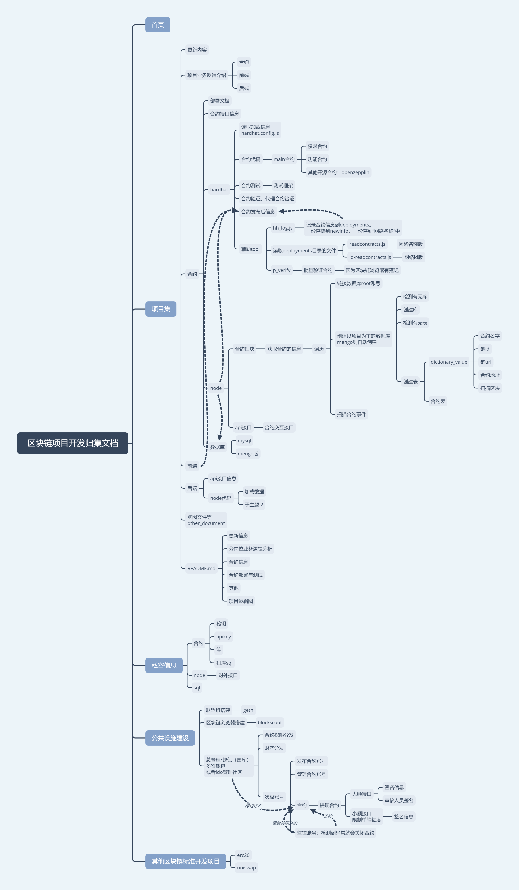

# VII_FRAME: Subproject of vii, An NFT project using agency contracts.
[更新](./update): 更新时间 v0.1 2022/05/10 16:16  
[Hardhat_Contract](./Hardhat_Contract)：合约的部署与测试  
[node](./node):node后端程序
[Function](./Function)：项目业务逻辑和合约的交互接口   
[Contract_info](./Hardhat_Contract/deployments/): 查看具体合约信息(newinfo为最新版)(network id，chain name，合约名称，abi，合约地址)  

## Tip
* [项目框架](#项目框架)

## 项目框架
[development.xmind](./other_document/development.xmind)  
  