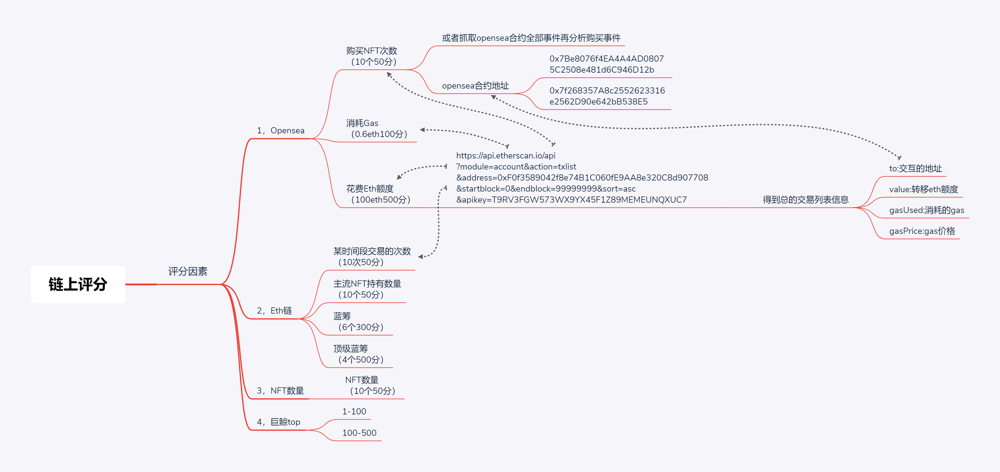

# VII_SCORES: Subproject of viide, 返回以太坊地址的用户数据，并根据权重计算分数。
[更新](./update): 更新时间 v0.1 2022/05/10 16:16  
[node](./node): 接口程序

## Tip
* [接口](#接口)
* [数据意义](#数据意义)
* [脑图](#脑图)

## 接口
获取地址最新数据并存储入库。
http://154.91.156.113:10902/v1/scores/update?address=0xaD07EFD5b2AA4cA6Fba38aAb878E626DA22C7816

获取地址之前的两组数据并存储入库。
http://154.91.156.113:10902/v1/scores/last?address=0xaD07EFD5b2AA4cA6Fba38aAb878E626DA22C7816

## 数据意义
|    参数       |         意义          |
|   -------------       |   -------------   |
|   total_score         |   总分            |
|   market_score        |   交易所操作分     |
|   on_chain_score      |   链上操作分       |
|      nft_score        |   账号nft持有分    |
|   time    |   更新时间戳  |
|   ranking |排名   |
|   totaluser   | 总用户数量   |
|   topaccount  |   是否是巨鲸用户  |
|   fistopenseatime |    第一次在nft交易所交易的时间戳  |
|   fist721time |   第一次获得nft721的时间戳    |

## 脑图
