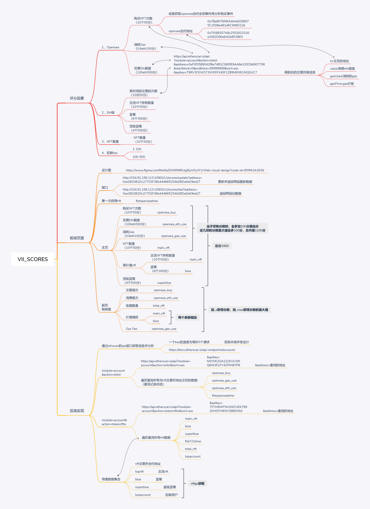

# VII_SCORES: Subproject of vii, 返回以太坊地址的用户数据，并根据权重计算分数。
[更新](./update): 更新时间 v0.1 2022/06/29 16:38  

[node](./node): 接口程序

## Tip
* [接口](#接口)
* [脑图](#脑图)
* [根据前端具体页面写的注释](#根据前端具体页面写的注释)

## 接口
获取地址最新数据并存储入库。
http://154.91.156.113:10902/v1/scores/update?address=0xaD07EFD5b2AA4cA6Fba38aAb878E626DA22C7816

获取地址之前的两组数据。
http://154.91.156.113:10902/v1/scores/last?address=0xaD07EFD5b2AA4cA6Fba38aAb878E626DA22C7816

## 脑图
[VII_SCORES.xmind](./other_document/VII_SCORES.xmind)  

## 根据前端具体页面写的注释
tip:update接口获得的data数据，数组0是最新的，数组1是上次获取的，数组2是记录的各分数项的上限。加“_s”获取项目分数，加“_max”获取项目分数上限。
### 主图所需参数
|   图上标识    |   参数    |   注释    |   其他    |
|   -------------       |   -------------   |   -------------       |   -------------   |
|   RANK TOP    |   ranking |   排名    |
|               |   totaluser   |   总人数  |
|   什么时候拥有第一个nft   |   fist721time |   |
|   “nft交易所”交易次数   |   opensea_buy |   |
|   “nft交易所”交易花费的eth    |   opensea_eth_use |       |
|   “nft交易所”交易消耗的gas  |   opensea_gas_use |     |
|   一共拥有的nft   |   total_nft   |   |
|   其中高价值的nft |   main_nft+blue  |   |
|   Crypto/BAYC持有个数     |   superblue   |   |

### 蜘蛛图

tip:加“_s”获取项目分数，加“_max”获取项目分数上限。
|   图上标识    |   参数    |   注释    |   其他    |
|   -------------       |   -------------   |   -------------   |   -------------   |
|   交易频次    |   opensea_buy   |   交易的次数    |       |
|   消费能力    |   opensea_eth_use |   花费的ETH数量   |   
|   收藏数量    |   total_nft    |   NFT持有量   |
|   价值捕获    |   main_nft+blue    |   top NFT的持有量 |
|   Gas Fee |   opensea_gas_use |       |
