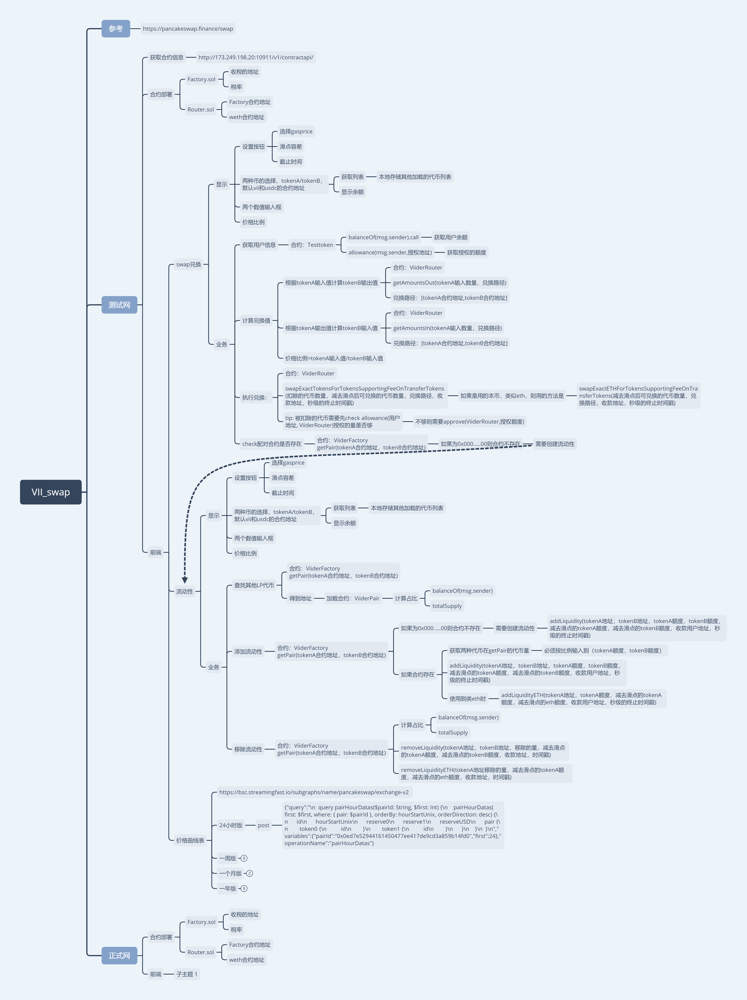

# VII_swap: Subproject of vii, swap。  
[更新](./update): 更新时间 v0.1 2022/05/10 16:16  
[Hardhat_Contract](./Hardhat_Contract)：合约的部署与测试  
[Contract_info](./Hardhat_Contract/deployments/): 查看具体合约信息(newinfo为最新版)(network id，chain name，合约名称，abi，合约地址)  

## Tip
* [项目框架](#项目框架)

## 项目框架
[VII_swap.pdf](./other_document/VII_swap.pdf)  
[VII_swap.xmind](./other_document/VII_swap.xmind)  
  

## 部署文档
