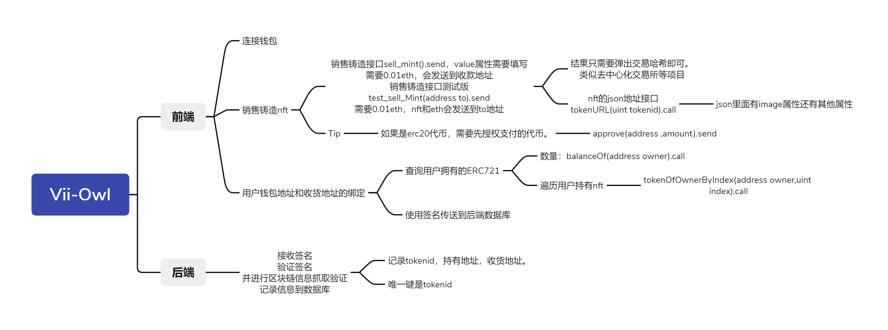

# Vii_Owl: Subproject of vii, A simple NFT project.
[更新](./update): 更新时间 v0.1 2022/05/10 16:16  
[Hardhat_Contract](./Hardhat_Contract)：合约的部署与测试  
[Function](./Function)：项目业务逻辑和合约的交互接口   
[Contract_info](./Hardhat_Contract/deployments/newinfo/VII_OWL.json): 选择网络后查看具体合约信息(network id，chain name，合约名称，abi，合约地址)  
[operate](./Operate)： Opensea的运营管理。

## Tip
* [测试网信息](#测试网信息)
* [项目框架](#项目框架)

## 测试网信息
|       |       |       |
|   -------------   |   -------------   |   -------------   |
|   network_name    |   polygon_mumbai  |   ZHAOMEI  |
|   network_id      |   80001           |   7156777  |
|   faucet          |   https://faucet.polygon.technology/  |   [无限测试币账户](./other/account.txt)  |
|                   |   https://mumbaifaucet.com/           |   |

## 项目框架
[Vii_Owl.xmind](./other_document/Vii_Owl.xmind)  
[Vii_Owl.pdf](./other_document/Vii_Owl.pdf)  
  

