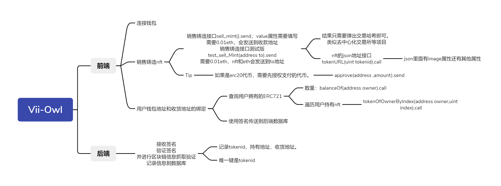

# Vii_Owl: Subproject of viide, An NFT project using agency contracts.
[Hardhat_Contract](./Hardhat_Contract)：合约的部署与测试  
[Web_Function](./Function/Web)：Vii_Owl项目前端和合约的交互接口  
[Back_Function](./Function/Back)：Vii_Owl项目后端和合约的交互接口  

## Tip
* [测试网信息](#测试网)

## 测试网信息
|   |  |
|   -------------   |   -------------   |
|   network_name    |   polygon_mumbai  |
|   network_id      |   80001           |
|   faucet          |   https://faucet.polygon.technology/  |
|                   |   https://mumbaifaucet.com/           |

## 项目总开发框架设计
[Vii_Owl.xmind](./other_document/Vii_Owl.xmind)  
[Vii_Owl.pdf](./other_document/Vii_Owl.pdf)  
  

